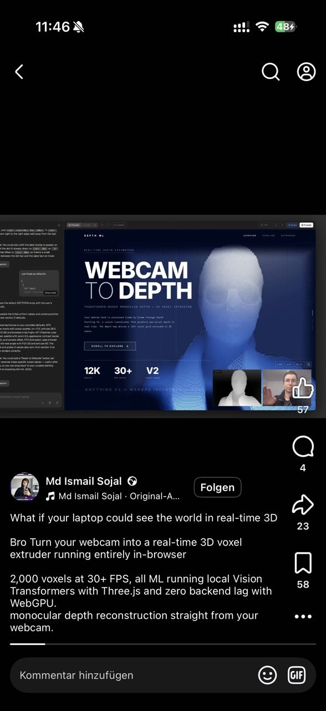

# Webcam to Depth: Real-time Monocular Depth Estimation



## Overview

This research document captures a impressive demo by **Md Ismail Sojal** showing real-time monocular depth estimation running entirely in the browser. The system transforms a standard webcam feed into a live 3D voxel representation using Vision Transformers and WebGPU acceleration.

## Demo Specifications

| Metric | Value |
|--------|-------|
| **Voxel Count** | 12,000 (UI display) / 2,000 (caption baseline) |
| **Frame Rate** | 30+ FPS |
| **Model** | Depth Anything V2 (Vision Transformer) |
| **Backend** | WebGPU (local GPU inference) |
| **3D Engine** | Three.js |
| **Latency** | Zero backend lag (all client-side) |

## Technical Stack

### ML Model: Depth Anything V2
- **Architecture**: Vision Transformer (ViT)
- **Task**: Monocular depth estimation (single image → depth map)
- **Version**: V2 (improved over V1 with better edge preservation)
- **Inference**: Runs locally via WebGPU

### Core Technologies

1. **WebGPU**
   - Modern browser API for GPU compute
   - Enables local ML inference without server round-trips
   - Supported in Chrome, Edge, Firefox (nightly)

2. **Three.js**
   - 3D rendering library
   - Voxel grid rendering with extrusion based on depth values
   - Real-time scene updates at 30+ FPS

3. **Vision Transformers (ViT)**
   - Transformer architecture adapted for computer vision
   - Self-attention mechanism captures global context
   - Better depth accuracy than CNN-based approaches

## How It Works

```
Webcam Feed
    ↓
[Preprocessing] → Resize, normalize
    ↓
[Depth Anything V2] → WebGPU inference
    ↓
Depth Map (grayscale, per-pixel depth)
    ↓
[Voxel Extrusion] → Three.js geometry generation
    ↓
3D Voxel Render (12K voxels @ 30+ FPS)
```

### Voxel Extrusion Process

1. **Grid Creation**: A 3D grid of voxel positions is created
2. **Depth Sampling**: Each voxel's Z-position is determined by sampling the depth map
3. **Height Mapping**: Depth values extrude voxels outward from a base plane
4. **Rendering**: Three.js InstancedMesh renders all voxels efficiently

## Implementation Path for OpenVJ

### Phase 1: Research & Prototyping

#### 1.1 Depth Model Integration
- [ ] Evaluate Depth Anything V2 for browser deployment
- [ ] Test alternative: MiDaS (lighter, possibly faster)
- [ ] Investigate TensorFlow.js vs ONNX Runtime Web
- [ ] Benchmark WebGPU vs WebGL performance

**Resources:**
- Depth Anything V2: https://github.com/DepthAnything/Depth-Anything-V2
- ONNX Runtime Web: https://onnxruntime.ai/docs/get-started/with-javascript/web.html
- TensorFlow.js: https://www.tensorflow.org/js

#### 1.2 WebGPU Setup
- [ ] Create WebGPU context initialization
- [ ] Implement compute shader for depth post-processing
- [ ] Handle fallback for non-WebGPU browsers (WebGL)

### Phase 2: Core Implementation

#### 2.1 Depth Estimation Module
```typescript
// Proposed API
interface DepthEstimator {
  initialize(modelPath: string): Promise<void>;
  estimateDepth(videoFrame: VideoFrame): Promise<DepthMap>;
  dispose(): void;
}

interface DepthMap {
  width: number;
  height: number;
  data: Float32Array; // Normalized depth values 0-1
}
```

#### 2.2 Voxel Renderer
- [ ] Three.js InstancedMesh setup for performant voxel rendering
- [ ] Real-time geometry updates from depth map
- [ ] Configurable voxel resolution (trade quality vs performance)
- [ ] Material/shader customization

```typescript
// Voxel configuration
interface VoxelConfig {
  resolutionX: number;  // e.g., 100
  resolutionY: number;  // e.g., 75
  maxVoxels: number;    // e.g., 12,000
  extrusionScale: number;
  baseColor: Color;
  depthColorMapping: boolean; // Color by depth
}
```

#### 2.3 Media Source Integration
OpenVJ already has webcam support. Extend it with:
- [ ] Depth estimation toggle per media source
- [ ] Depth map preview ( Picture-in-picture like the demo)
- [ ] Raw video + depth side-by-side option

### Phase 3: OpenVJ Integration

#### 3.1 New Media Type: "Depth Stream"
```typescript
// New media source type
type DepthMediaSource = {
  type: 'depth-stream';
  source: 'webcam' | 'video' | 'image';
  depthEnabled: boolean;
  voxelConfig: VoxelConfig;
  renderMode: 'voxels' | 'pointcloud' | 'mesh';
}
```

#### 3.2 Render Modes
Beyond voxels, support:
1. **Voxel Extrusion** (like the demo) - blocky, retro aesthetic
2. **Point Cloud** - raw depth points, potentially millions
3. **Mesh Reconstruction** - smooth surface from depth (more processing)

#### 3.3 Shader Integration
- [ ] Expose depth uniforms to existing shader system
- [ ] `uDepthMap` sampler2D uniform
- [ ] `uDepthMin`, `uDepthMax` for range control
- [ ] Audio-reactive depth displacement

### Phase 4: Performance Optimization

#### 4.1 Frame Rate Targets
| Quality | Voxels | Target FPS | Use Case |
|---------|--------|------------|----------|
| Low | 2,000 | 60 FPS | Live performance, fast motion |
| Medium | 6,000 | 30 FPS | Balanced quality/performance |
| High | 12,000 | 30 FPS | Static installations, recordings |
| Ultra | 50,000 | 15 FPS | Non-real-time rendering |

#### 4.2 Optimization Strategies
- [ ] **Downsampling**: Run depth model on lower resolution (e.g., 256x192)
- [ ] **Temporal smoothing**: Reduce flickering between frames
- [ ] **LOD (Level of Detail)**: Reduce voxel count when camera moves fast
- [ ] **Web Workers**: Offload depth inference from main thread
- [ ] **InstancedMesh**: Efficient GPU voxel rendering

### Phase 5: Creative Features

#### 5.1 Audio-Reactive Depth
```glsl
// Example: Audio drives extrusion height
float extrusion = depthValue * uExtrusionScale;
extrusion *= (1.0 + uAudioLow * 0.5); // Bass pumps depth
```

#### 5.2 Effects Pipeline
- [ ] Depth-based fog/haze
- [ ] Edge detection on depth discontinuities
- [ ] Temporal trails (motion blur in Z-space)
- [ ] Particle systems spawned at depth edges

#### 5.3 Projection Mapping Integration
- [ ] Warp depth-rendered output to surfaces
- [ ] Multiple depth sources for multi-camera setups
- [ ] Depth-based masking for occlusions

## Technical Challenges & Solutions

### Challenge 1: WebGPU Availability
**Problem**: Not all browsers/devices support WebGPU yet.
**Solution**: Graceful fallback to WebGL or CPU inference. Show warning but remain functional.

### Challenge 2: Model Size
**Problem**: Depth models are large (100MB+).
**Solution**: 
- Quantize to INT8 (4x smaller)
- Stream model weights progressively
- Cache in IndexedDB after first load

### Challenge 3: Latency
**Problem**: ML inference can introduce frame delay.
**Solution**:
- Predictive rendering (extrapolate next frame)
- Async inference (render previous depth while computing next)
- Accept single-frame latency for quality

### Challenge 4: GPU Memory
**Problem**: 12K voxels + ML model + Three.js scene = VRAM pressure.
**Solution**:
- Dispose unused textures aggressively
- Use texture compression (BC7, ETC2)
- Limit concurrent depth sources

## Reference Implementations

### Depth Anything V2 Web Demo
```javascript
// Conceptual integration
import { DepthAnything } from '@xenova/depth-anything';

const depthModel = await DepthAnything.from_pretrained('Xenova/depth-anything-v2-small');

async function processFrame(video) {
  const depth = await depthModel(video);
  return depth.toTensor();
}
```

### Three.js Voxel Rendering
```javascript
// InstancedMesh for performant voxels
const geometry = new THREE.BoxGeometry(0.1, 0.1, 0.1);
const material = new THREE.MeshBasicMaterial({ color: 0xffffff });
const voxels = new THREE.InstancedMesh(geometry, material, maxVoxels);

// Update positions from depth map
const dummy = new THREE.Object3D();
for (let i = 0; i < voxelCount; i++) {
  const x = (i % width) / width * scale;
  const y = Math.floor(i / width) / height * scale;
  const z = depthData[i] * extrusion;
  dummy.position.set(x, y, z);
  dummy.updateMatrix();
  voxels.setMatrixAt(i, dummy.matrix);
}
voxels.instanceMatrix.needsUpdate = true;
```

## Inspiration Gallery

Similar projects and references:

1. **Depth Anything V2** - https://depth-anything.github.io/
2. **Three.js Webcam displacement** - Common technique in creative coding
3. **Kinect + VJ performances** - Historical precedent using depth cameras
4. **MediaPipe Depth** - Google's alternative depth estimation

## Next Steps

1. [ ] Create proof-of-concept: Depth Anything V2 + Three.js minimal demo
2. [ ] Evaluate performance on target hardware (starter laptops)
3. [ ] Design OpenVJ-specific UI for depth controls
4. [ ] Integrate with existing shader system
5. [ ] Test projection mapping workflows with depth content

## Related OpenVJ Features

- Existing webcam input system
- Shader uniforms (can expose depth data)
- p5.js Bridge API (could add depth access)
- MIDI/audio reactivity (can modulate depth parameters)

---

*Research captured: 2026-04-22*
*Source: Md Ismail Sojal - https://www.facebook.com/share/v/1DpfJNNhCN/*
